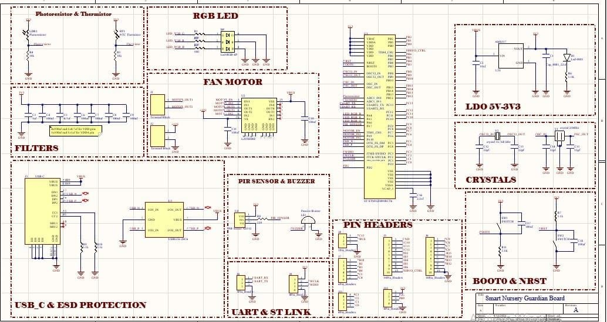
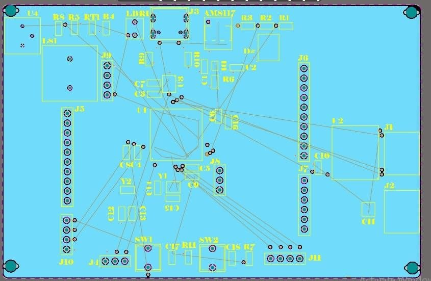
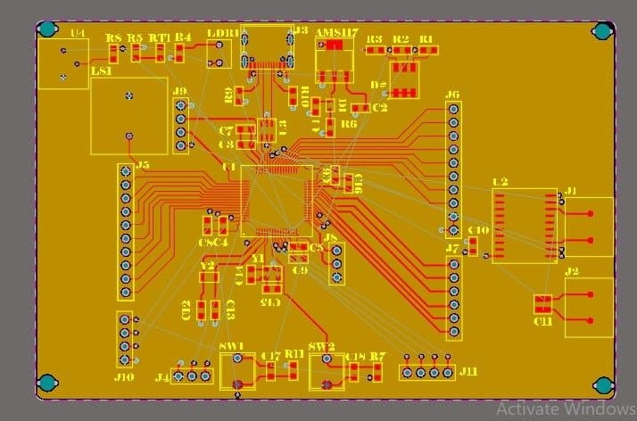
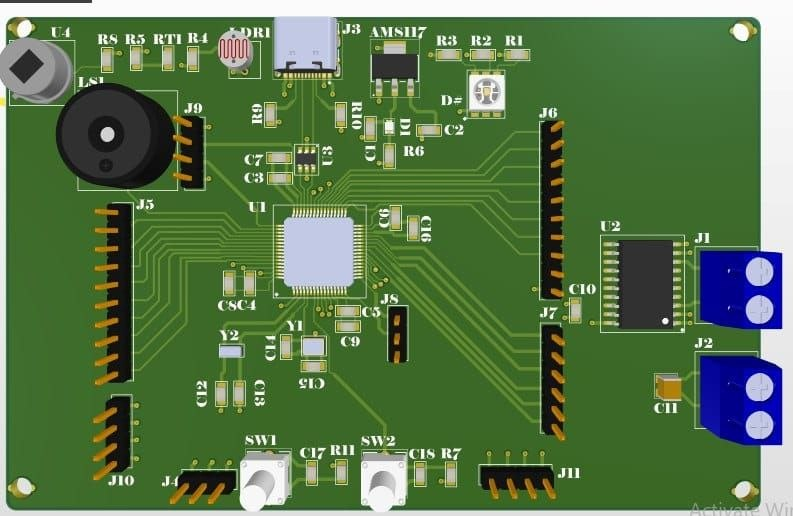

# smart-nursey-home-project
# Smart Nursery Guardian

### AI-Assisted Embedded Monitoring System for Infant Care

Smart Nursery Guardian is an end-to-end intelligent monitoring system
that combines **Machine Learning, Embedded Systems, Sensor Monitoring,
Real-Time Control, GUI Development, and IoT Alerts** to assist in infant care.

The system analyzes baby-cry audio, monitors the nursery environment,
and automatically responds to different conditions using an STM32
microcontroller and a Python application.

---

## Key Features

Baby cry classification: Hungry, Tired, and Discomfort
MFCC-based audio feature extraction
Machine Learning classification
Temperature monitoring and automatic fan control
Smart lighting using LDR and motion detection
Gas/smoke detection
Telegram emergency notifications
Servo-based crib rocking
Python Tkinter GUI
Serial communication between Python and STM32
STM32-based sensor and actuator control
Custom PCB design using Altium Designer

---

## System Architecture

The system is divided into two main parts:

### Python Application

Responsible for:

- Audio processing
- MFCC feature extraction
- Machine Learning inference
- GUI visualization
- Telegram notifications
- Serial communication

### 🔧 STM32 Embedded System

Responsible for:

- PIR motion detection
- Temperature sensing
- Light sensing
- Gas/smoke detection
- Servo control
- Cooling fan control
- LED control
- Buzzer control

The Python application and STM32 communicate through serial communication.

---

## Machine Learning Pipeline

Baby Cry Audio

↓

Audio Preprocessing

↓

MFCC Feature Extraction

↓

Machine Learning Model

↓

Hungry / Tired / Discomfort

---

## System Flow

Sensors → STM32 → Serial Communication → Python Application

Baby Cry → Audio Processing → ML Classification → GUI Response

Gas Detection → STM32 → Python → Telegram Alert

---

## Technologies

### Software & AI

`Python` `Scikit-learn` `Librosa` `MFCC` `Joblib` `Tkinter`

### Embedded Systems

`STM32` `UART` `ADC` `PWM` `Sensors` `Actuators`

### Hardware Design

`Altium Designer` `Schematic Design` `PCB Layout`

---
## PCB Design

### PCB Schematic

The complete schematic of the Smart Nursery Guardian board, including the
STM32 microcontroller, power regulation, sensor interfaces, motor control,
USB-C protection, communication interfaces, and support circuitry.

  

### PCB Component Placement

  

### PCB Layout & Routing

  

### 3D PCB View

  

## Contributors

https://github.com/salmamahmoud1532007-arch

Developed as a multidisciplinary project combining Machine Learning,
Embedded Systems, Hardware Design, and Software Integration.
